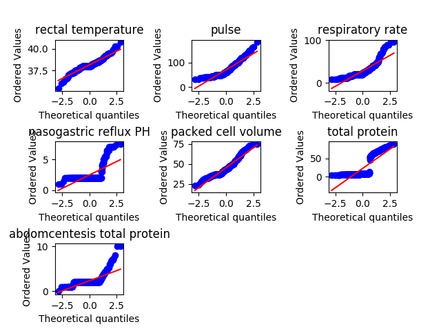

[TOC]
# Horse Colic 马的疝病分析

## 1. 问题描述
疝病是描述马胃肠痛的术语，这种病不一定源自马的胃肠问题，其他问题也可能引发马疝病。所给数据集是医院检测的一些指标。
## 2. 数据集信息

### 2.1 数据集文件列表
- horse-colic.data: 300个训练实例 
- horse-colic.test: 68个测试实例

数据类型: 连续、离散、标称

### 2.2 属性列表

> 内容较多，在文末给出

## 3 数据分析要求

### 3.1 数据可视化和摘要

#### 数据摘要

- 标称属性，给出每个可能取值的频数
- 数值属性，给出最大、最小、均值、中位数、四分位数及缺失值的个数。
数据的可视化

#### 针对数值属性

- 绘制直方图，如mxPH，用qq图检验其分布是否为正态分布。
- 绘制盒图，对离群值进行识别

### 3.2 数据缺失的处理

###### 数据集中有30%的值是缺失的，因此需要先处理数据中的缺失值。

###### 分别使用下列四种策略对缺失值进行处理:

- 将缺失部分剔除
- 用最高频率值来填补缺失值
- 通过属性的相关关系来填补缺失值
- 通过数据对象之间的相似性来填补缺失值
###### 处理后，可视化地对比新旧数据集。
## 3 实验环境
- Ubuntu 14.04
- Python 2.7
- matplotlib 2.0.0
- Numpy 1.12.1
- pandas 0.19.2
- scipy 0.19.0

## 4 实验过程

### 4.1 数据摘要
#### 4.1.2 标称属性 

##### surgery:
|1.0|2.0|
|:--------:|:--------:|
|180|119|

##### Age:
|1.0|9.0|
|:--------:|:--------:|
|276|24|

##### Hospital Number:
|535043.0|527365.0|530438.0|530439.0|528904.0|527883.0|535054.0|529424.0|529427.0|529428.0|5282839.0|533836.0|534556.0|534618.0|5294539.0|5297379.0|528931.0|5294369.0|534053.0|529960.0|5290759.0|527916.0|535085.0|530478.0|534280.0|534579.0|529461.0|527927.0|527929.0|527933.0|534197.0|529475.0|528964.0|533942.0|535031.0|529483.0|534092.0|528461.0|5279822.0|528977.0|530002.0|534787.0|528469.0|534615.0|530276.0|529498.0|533736.0|530526.0|534624.0|535137.0|534626.0|534115.0|528996.0|529766.0|533696.0|527463.0|5297159.0|5283431.0|530028.0|529518.0|5277409.0|530544.0|530034.0|5287279.0|534644.0|535158.0|528503.0|529528.0|535163.0|535166.0|534293.0|530561.0|530051.0|527702.0|528006.0|535176.0|528523.0|534157.0|532110.0|528019.0|529045.0|533738.0|535407.0|535196.0|527518.0|528031.0|527524.0|534183.0|535208.0|5291719.0|528047.0|534899.0|530612.0|530101.0|521399.0|527544.0|535381.0|528570.0|533692.0|534719.0|530624.0|533697.0|5278331.0|530294.0|529607.0|535240.0|527563.0|5305629.0|5262541.0|528590.0|5262543.0|528248.0|5279442.0|535246.0|5289419.0|533723.0|529628.0|5275212.0|533968.0|522979.0|534756.0|529126.0|5279441.0|529640.0|529642.0|528620.0|530157.0|530670.0|529135.0|528630.0|5305129.0|530170.0|535292.0|535338.0|528638.0|529663.0|534784.0|528641.0|529667.0|534788.0|530693.0|528134.0|534145.0|529160.0|534572.0|5287179.0|528653.0|535314.0|534403.0|529172.0|529685.0|528151.0|528668.0|5299253.0|529183.0|533793.0|535330.0|529703.0|528169.0|528682.0|534135.0|534817.0|526639.0|534833.0|528178.0|528179.0|534324.0|528183.0|530233.0|527677.0|528702.0|530239.0|529729.0|530242.0|5281091.0|535364.0|534753.0|529736.0|534857.0|530251.0|518476.0|530254.0|530255.0|527698.0|535415.0|533902.0|528214.0|533847.0|528729.0|527706.0|527709.0|5288249.0|535392.0|529764.0|534885.0|528742.0|528743.0|534069.0|533871.0|529777.0|534163.0|527734.0|528247.0|529272.0|530297.0|530301.0|533886.0|533887.0|5292929.0|534073.0|529796.0|534917.0|530310.0|5291329.0|534925.0|527758.0|530319.0|529296.0|5291409.0|5299603.0|529812.0|534933.0|529304.0|527940.0|534938.0|529493.0|530334.0|534597.0|528800.0|5292489.0|529827.0|528804.0|532349.0|533928.0|5290409.0|528298.0|528299.0|528812.0|5299629.0|529821.0|529840.0|528305.0|530354.0|534963.0|523190.0|530360.0|529849.0|529340.0|530366.0|5301219.0|533750.0|529865.0|534519.0|530381.0|534478.0|530384.0|521681.0|526802.0|527829.0|534998.0|533885.0|528548.0|534491.0|529373.0|533983.0|529888.0|530401.0|530402.0|528355.0|535130.0|529893.0|530001.0|528872.0|529386.0|529388.0|5290481.0|5290482.0|534004.0|535029.0|529399.0|532985.0|528890.0|530431.0|527957.0|
|:--------:|:--------:|:--------:|:--------:|:--------:|:--------:|:--------:|:--------:|:--------:|:--------:|:--------:|:--------:|:--------:|:--------:|:--------:|:--------:|:--------:|:--------:|:--------:|:--------:|:--------:|:--------:|:--------:|:--------:|:--------:|:--------:|:--------:|:--------:|:--------:|:--------:|:--------:|:--------:|:--------:|:--------:|:--------:|:--------:|:--------:|:--------:|:--------:|:--------:|:--------:|:--------:|:--------:|:--------:|:--------:|:--------:|:--------:|:--------:|:--------:|:--------:|:--------:|:--------:|:--------:|:--------:|:--------:|:--------:|:--------:|:--------:|:--------:|:--------:|:--------:|:--------:|:--------:|:--------:|:--------:|:--------:|:--------:|:--------:|:--------:|:--------:|:--------:|:--------:|:--------:|:--------:|:--------:|:--------:|:--------:|:--------:|:--------:|:--------:|:--------:|:--------:|:--------:|:--------:|:--------:|:--------:|:--------:|:--------:|:--------:|:--------:|:--------:|:--------:|:--------:|:--------:|:--------:|:--------:|:--------:|:--------:|:--------:|:--------:|:--------:|:--------:|:--------:|:--------:|:--------:|:--------:|:--------:|:--------:|:--------:|:--------:|:--------:|:--------:|:--------:|:--------:|:--------:|:--------:|:--------:|:--------:|:--------:|:--------:|:--------:|:--------:|:--------:|:--------:|:--------:|:--------:|:--------:|:--------:|:--------:|:--------:|:--------:|:--------:|:--------:|:--------:|:--------:|:--------:|:--------:|:--------:|:--------:|:--------:|:--------:|:--------:|:--------:|:--------:|:--------:|:--------:|:--------:|:--------:|:--------:|:--------:|:--------:|:--------:|:--------:|:--------:|:--------:|:--------:|:--------:|:--------:|:--------:|:--------:|:--------:|:--------:|:--------:|:--------:|:--------:|:--------:|:--------:|:--------:|:--------:|:--------:|:--------:|:--------:|:--------:|:--------:|:--------:|:--------:|:--------:|:--------:|:--------:|:--------:|:--------:|:--------:|:--------:|:--------:|:--------:|:--------:|:--------:|:--------:|:--------:|:--------:|:--------:|:--------:|:--------:|:--------:|:--------:|:--------:|:--------:|:--------:|:--------:|:--------:|:--------:|:--------:|:--------:|:--------:|:--------:|:--------:|:--------:|:--------:|:--------:|:--------:|:--------:|:--------:|:--------:|:--------:|:--------:|:--------:|:--------:|:--------:|:--------:|:--------:|:--------:|:--------:|:--------:|:--------:|:--------:|:--------:|:--------:|:--------:|:--------:|:--------:|:--------:|:--------:|:--------:|:--------:|:--------:|:--------:|:--------:|:--------:|:--------:|:--------:|:--------:|:--------:|:--------:|:--------:|:--------:|:--------:|:--------:|:--------:|:--------:|:--------:|:--------:|:--------:|:--------:|:--------:|:--------:|:--------:|:--------:|:--------:|:--------:|:--------:|:--------:|:--------:|:--------:|:--------:|:--------:|:--------:|:--------:|:--------:|:--------:|:--------:|:--------:|:--------:|:--------:|:--------:|:--------:|:--------:|:--------:|:--------:|:--------:|:--------:|:--------:|:--------:|:--------:|:--------:|
|1|1|1|1|2|1|1|2|1|1|1|1|1|1|1|1|2|1|1|1|1|2|1|1|1|1|2|1|1|1|1|1|1|1|1|1|1|1|2|1|1|1|2|1|1|1|1|2|1|1|1|1|2|1|1|1|1|1|1|1|1|1|1|1|1|1|1|1|1|1|1|1|1|1|1|1|1|1|1|1|1|1|1|1|1|1|1|1|1|1|1|1|1|1|1|2|1|1|1|1|1|1|1|1|1|1|1|1|1|1|1|1|1|1|1|1|1|1|1|1|1|1|1|1|1|1|1|1|1|1|1|1|1|1|1|1|1|1|1|1|2|1|1|1|1|1|1|1|1|1|1|2|1|1|1|1|1|1|1|1|1|1|1|1|1|1|1|1|1|1|1|1|1|1|1|1|1|1|1|1|1|1|1|1|1|1|1|1|2|1|1|1|1|1|1|1|1|1|1|1|1|1|1|1|1|1|1|1|1|1|2|1|1|1|1|1|1|1|1|1|1|1|1|1|1|1|1|1|1|1|1|1|2|1|1|1|1|1|1|1|1|1|1|1|1|1|1|1|1|1|1|1|1|1|1|1|1|1|1|1|1|1|1|1|1|1|1|1|1|1|1|1|1|1|1|1|1|1|1|1|1|2|1|1|

##### temperature of extremities:
|1.0|2.0|3.0|4.0|
|:--------:|:--------:|:--------:|:--------:|
|78|30|109|27|

##### peripheral pulse:
|1.0|2.0|3.0|4.0|
|:--------:|:--------:|:--------:|:--------:|
|115|5|103|8|

##### mucous membranes:
|1.0|2.0|3.0|4.0|5.0|6.0|
|:--------:|:--------:|:--------:|:--------:|:--------:|:--------:|
|79|30|58|41|25|20|

##### capillary refill time:
|1.0|2.0|3.0|
|:--------:|:--------:|:--------:|
|188|78|2|

##### pain:
|1.0|2.0|3.0|4.0|5.0|
|:--------:|:--------:|:--------:|:--------:|:--------:|
|38|59|67|39|42|

##### peristalsis:
|1.0|2.0|3.0|4.0|
|:--------:|:--------:|:--------:|:--------:|
|39|16|128|73|

##### abdominal distension:
|1.0|2.0|3.0|4.0|
|:--------:|:--------:|:--------:|:--------:|
|76|65|65|38|

##### nasogastric tube:
|1.0|2.0|3.0|
|:--------:|:--------:|:--------:|
|71|102|23|

##### nasogastric reflux:
|1.0|2.0|3.0|
|:--------:|:--------:|:--------:|
|120|35|39|

##### rectal examination:
|1.0|2.0|3.0|4.0|
|:--------:|:--------:|:--------:|:--------:|
|57|13|49|79|

##### abdomen:
|1.0|2.0|3.0|4.0|5.0|
|:--------:|:--------:|:--------:|:--------:|:--------:|
|28|19|13|43|79|

##### abdominocentesis appearance:
|1.0|2.0|3.0|
|:--------:|:--------:|:--------:|
|41|48|46|

##### outcome:
|1.0|2.0|3.0|
|:--------:|:--------:|:--------:|
|178|77|44|

##### surgical lesion:
|1.0|2.0|
|:--------:|:--------:|
|191|109|

##### type of lesion 1:
|0.0|2305.0|5124.0|3205.0|31110.0|3207.0|5000.0|3209.0|4111.0|400.0|2322.0|41110.0|5400.0|4122.0|4124.0|2205.0|2206.0|2207.0|2208.0|2209.0|11300.0|3111.0|3112.0|3113.0|3115.0|300.0|12208.0|11400.0|3124.0|7209.0|7113.0|9400.0|3133.0|2111.0|2112.0|2113.0|7111.0|3400.0|4300.0|2124.0|8400.0|3025.0|5205.0|5206.0|1111.0|3300.0|6111.0|6112.0|1124.0|6209.0|7400.0|8300.0|4205.0|4206.0|4207.0|9000.0|11124.0|21110.0|5111.0|1400.0|2300.0|
|:--------:|:--------:|:--------:|:--------:|:--------:|:--------:|:--------:|:--------:|:--------:|:--------:|:--------:|:--------:|:--------:|:--------:|:--------:|:--------:|:--------:|:--------:|:--------:|:--------:|:--------:|:--------:|:--------:|:--------:|:--------:|:--------:|:--------:|:--------:|:--------:|:--------:|:--------:|:--------:|:--------:|:--------:|:--------:|:--------:|:--------:|:--------:|:--------:|:--------:|:--------:|:--------:|:--------:|:--------:|:--------:|:--------:|:--------:|:--------:|:--------:|:--------:|:--------:|:--------:|:--------:|:--------:|:--------:|:--------:|:--------:|:--------:|:--------:|:--------:|:--------:|
|56|1|2|29|7|1|1|4|1|5|2|1|4|1|3|13|4|3|20|11|1|33|3|1|1|1|1|1|2|3|1|2|1|3|5|6|7|1|4|9|2|2|1|2|1|1|2|2|1|1|1|1|11|1|1|1|2|1|2|8|1|

##### type of lesion 2:
|0.0|6112.0|7111.0|3112.0|3111.0|1400.0|
|:--------:|:--------:|:--------:|:--------:|:--------:|:--------:|
|293|1|1|1|3|1|

##### type of lesion 3:
|0.0|2209.0|
|:--------:|:--------:|
|299|1|

#### 4.1.2 数值属性

|Attribute | Maximum | Minumum | Mean | Medium | Quartile| Missing|
|:--------:|:---------:|:-------:|:-------:|:-------:|:-------:|:-------:|
|rectal temperature |40.80|35.40|38.17|38.20|37.8|60|
pulse |184.0|30.0|71.91|64.0|48.0|24|
respiratory rate |96.0|8.0|30.41|24.5|18.5|58|
nasogastric reflux PH |7.5|1.0|4.70|5.0|3.0|274|
packed cell volume |75.0|23.0|46.30|45.0|38.0|29|
total protein |89.0|3.30|24.46|7.5|6.5|33|
abdomcentesis total protein |10.1|0.10|3.02|2.25|2.0|198|

#### 4.1.3 数值属性的可视化
可视化工具采用了matplotlib和scipy两个Python库
直方图和盒图采用matplotlib.pyplot中的hist和boxplot函数进行绘制
Q-Q图采用scipy.stats.probplot函数进行绘制

##### 直方图

##### Q-Q图

> 可以看出，rectal temperature 和 packed cell volume两种属性的分布近似于正态分布

##### 盒图

### 4.2 数据缺失的处理 

#### 4.2.1 将缺失部分剔除
缺省方式，已经在上文给出
#### 4.2.2 用最高频率值来填补缺失值
##### 直方图

##### Q-Q图

##### 盒图

#### 4.2.3 通过属性的相关关系来填补缺失值
##### 直方图

##### Q-Q图

##### 盒图

#### 4.2.4 通过数据对象之间的相似性来填补缺失值
##### 直方图

##### Q-Q图

##### 盒图

| No.| Attribute| Value| Explanation
|:--------:|:---------:|:-------|:-------|
|1| surgery | 1,2 |  1 = Yes, it had surgery 2 = It was treated without surgery |
|2| Age |1,2|1 = Adult horse   2 = Young (< 6 months) |
|3| Hospital Number | numeric id|the case number assigned to the horse (may not be unique if the horse is treated > 1 time) |
|4|rectal temperature |linear in degrees celsius.|An elevated temp may occur due to infection.  temperature may be reduced when the animal is in late shock  normal temp is 37.8  this parameter will usually change as the problem progresses, eg. may start out normal, then become elevated because of the lesion, passing back through the normal range as the horse goes into shock |
|5|pulse|linear|the heart rate in beats per minute is a reflection of the heart condition: 30 -40 is normal for adults rare to have a lower than normal rate although athletic horses may have a rate of 20-25 animals with painful lesions or suffering from circulatory shock may have an elevated heart rate| 
|6|respiratory rate|linear|normal rate is 8 to 10 usefulness is doubtful due to the great fluctuations| 
|7| temperature of extremities|1 = Normal 2 = Warm 3 = Cool 4 = Cold|a subjective indication of peripheral circulation  cool to cold extremities indicate possible shock  hot extremities should correlate with an elevated rectal temp|
|8| peripheral pulse|subjective 1 = normal 2 = increased  3 = reduced  4 = absent|normal or increased p.p. are indicative of adequate circulation while reduced or absent indicate poor perfusion |
|9| mucous membranes|1 = normal pink 2 = bright pink 3 = pale pink 4 = pale cyanotic 5 = bright red / injected 6 = dark cyanotic|a subjective measurement of colour 1 and 2 probably indicate a normal or slightly increased circulation 3 may occur in early shock 4 and 6 are indicative of serious circulatory compromise 5 is more indicative of a septicemia 
|10|capillary refill time | 1 = < 3 seconds  2 = >= 3 seconds |a clinical judgement The longer the refill, the poorer the circulation 
|11| pain | 1 = alert, no pain;2 = depressed;3 = intermittent mild pain;4 = intermittent severe pain  5 = continuous severe pain |a subjective judgement of the horse's pain level  should NOT be treated as a ordered or discrete variable!  In general, the more painful, the more likely it is to require surgery  prior treatment of pain may mask the pain level to some extent 
|12|peristalsis |1 = hypermotile  2 = normal  3 = hypomotile  4 = absent|an indication of the activity in the horse's gut. As the gut becomes more distended or the horse becomes more toxic, the activity decreases |
|13|abdominal distension |1 = none  2 = slight  3 = moderate  4 = severe |An IMPORTANT parameter. an animal with abdominal distension is likely to be painful and have reduced gut motility. a horse with severe abdominal distension is likely to require surgery just tio relieve the pressure 
|14| nasogastric tube |1 = none  2 = slight  3 = significant |this refers to any gas coming out of the tube a large gas cap in the stomach is likely to give the horse discomfort|
|15| nasogastric reflux |1 = none  2 = > 1 liter  3 = < 1 liter |the greater amount of reflux, the more likelihood that there is some serious obstruction to the fluid passage from the rest of the intestine|
|16| nasogastric reflux PH| linear |scale is from 0 to 14 with 7 being neutral normal values are in the 3 to 4 range |
|17| rectal examination |1 = normal  2 = increased  3 = decreased 4 = absent|feces possible values  absent feces probably indicates an obstruction |
|18| abdomen|1 = normal  2 = other  3 = firm feces in the large intestine  4 = distended small intestine  5 = distended large intestine  |3 is probably an obstruction caused by a mechanical impaction and is normally treated medically  4 and 5 indicate a surgical lesion |
|19| packed cell volume |linear |the # of red cells by volume in the blood  normal range is 30 to 50. The level rises as the circulation becomes compromised or as the animal becomes dehydrated.| 
|20| total protein |linear|normal values lie in the 6-7.5 (gms/dL) range  the higher the value the greater the dehydration| 
|21| abdominocentesis appearance |1 = clear  2 = cloudy  3 = serosanguinous |a needle is put in the horse's abdomen and fluid is obtained from the abdominal cavity  normal fluid is clear while cloudy or serosanguinous indicates a compromised gut |
|22| abdomcentesis total protein|linear|the higher the level of protein the more likely it is to have a compromised gut. Values are in gms/dL 
|23| outcome|1 = lived  2 = died  3 = was euthanized |what eventually happened to the horse? 
|24| surgical lesion?|1 = Yes  2 = No |retrospectively, was the problem (lesion) surgical?  all cases are either operated upon or autopsied so that this value and the lesion type are always known| 
|25, 26, 27| type of lesion | Four numbers|Show as below|
|first number|site of lesion |1-00|1 = gastric 2 = sm intestine 3 = lg colon 4 = lg colon and cecum 5 = cecum  6 = transverse colon 7 = retum/descending colon  8 = uterus  9 = bladder  11 = all intestinal sites  00 = none  |
|second number| type |1,2,3,4|1 = simple  2 = strangulation  3 = inflammation 4 = other 
|third number | subtype |1,2,0|1 = mechanical  2 = paralytic  0 = n/a  |
|fourth number | specific code |1-0|1 = obturation  2 = intrinsic  3 = extrinsic  4 = adynamic  5 = volvulus/torsion  6 = intussuption  7 = thromboembolic  8 = hernia  9 = lipoma/slenic incarceration  10 = displacement  0 = n/a |
|28|cp_data| 1 = Yes  2 = No|is pathology data present for this case?  this variable is of no significance since pathology data is not included or collected for these cases
